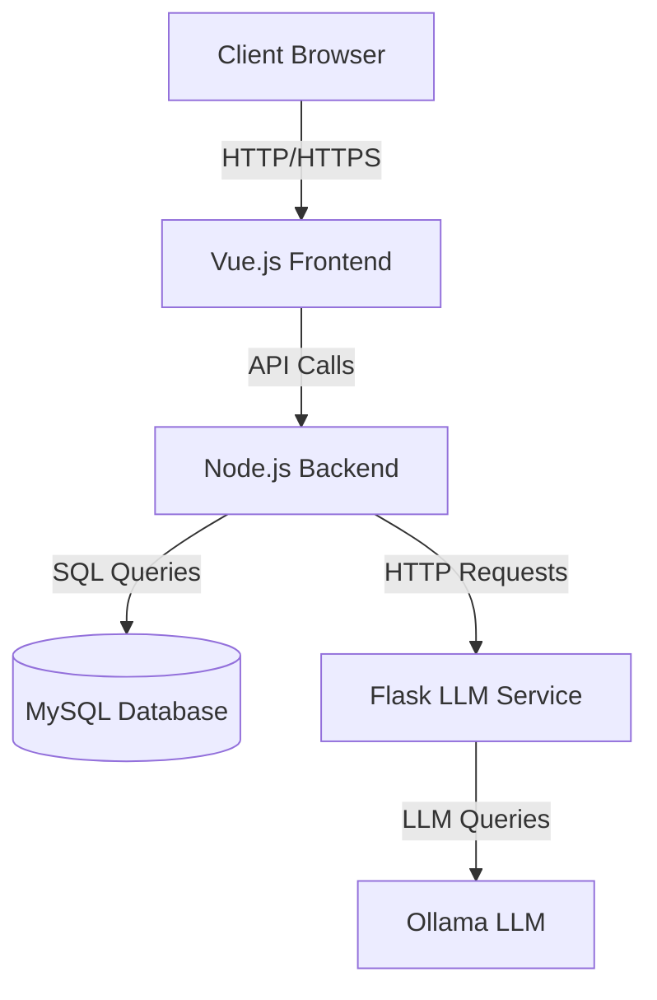
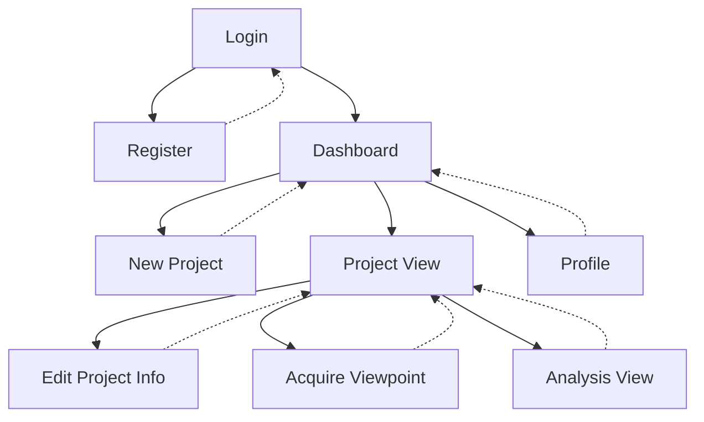

# CIcERonE WebApp: Architettura e Struttura

## Descrizione Generale

CIcERonE WebApp è un'applicazione web a pagina singola (SPA) progettata per la gestione della Contextual Inquiry. L'architettura è composta da:

1. **Frontend**: Implementato con Vue.js, gestisce l'interfaccia utente e le interazioni.
2. **Backend**: Un server Node.js con Express che gestisce le API, l'autenticazione e la comunicazione con il database.
3. **Database**: MySQL per la persistenza dei dati degli utenti e dei progetti.
4. **Servizio LLM**: Un server Flask separato che gestisce l'elaborazione del linguaggio naturale utilizzando il modello LLM Ollama.

Questa struttura permette una separazione chiara delle responsabilità, con il frontend che gestisce la presentazione, il backend che gestisce la logica di business e l'accesso ai dati, e il servizio LLM che si occupa dell'elaborazione avanzata del linguaggio naturale.
## 1. Architettura del Sistema


[](https://mermaid.live/edit#pako:eNpV0E1PwzAMBuC_YuUE0gb3HpDWdhVIHWy04pL2YBpvLUvTkQ_QtO6_k5RpiByi5NVjW8mJNYMgFrGdxkMLZVop8GvBE9mRshDr4duQrmE-fxgfy3J9H7ZihJi_Obr7MJDpQVlSov6tjCe5WD9BglKaERL-7CcEGWOz_4PJBItNDhtHuiNPU36zOoYkRYvvaOj2nw2T4ZU-HRnr9ZJnEs0e8nwFBemvrqELX0485NfWGX-REnsMumYz1pPusRP-4adQUzHbUk8Vi_xR0BadtBWr1NlTdHYojqphkdWOZkwPbteyaIvS-Js7CLSUdug_sL-k5x9l9W5L)

## 2. Struttura del Progetto

```
cicerone-webapp/
├── frontend/
│   ├── src/
│   │   ├── components/
│   │   │   ├── Login.vue
│   │   │   ├── Register.vue
│   │   │   ├── Dashboard.vue
│   │   │   ├── NewProject.vue
│   │   │   ├── EditProjectInfo.vue
│   │   │   ├── ProjectView.vue
│   │   │   ├── AcquireViewpoint.vue
│   │   │   ├── AnalysisView.vue
│   │   │   └── Profile.vue
│   │   ├── router/
│   │   │   └── index.js
│   │   ├── App.vue
│   │   └── main.js
│   ├── public/
│   └── package.json
├── backend/
│   ├── routes/
│   │   ├── auth.js
│   │   ├── projects.js
│   │   └── users.js
│   ├── middleware/
│   │   └── authenticateToken.js
│   ├── db.js
│   ├── dbInit.js
│   └── server.js
├── flaskRAG/
│   ├── app.py
│   ├── database.py
│   └── llm_functions.py
├── docs/
└── .env
```

## 3. Schema del Database

```sql
CREATE TABLE users (
  id INT AUTO_INCREMENT PRIMARY KEY,
  username VARCHAR(255) NOT NULL UNIQUE,
  password VARCHAR(255) NOT NULL,
  email VARCHAR(255) NOT NULL UNIQUE,
  created_at TIMESTAMP DEFAULT CURRENT_TIMESTAMP
);

CREATE TABLE projects (
  id INT AUTO_INCREMENT PRIMARY KEY,
  user_id INT NOT NULL,
  title VARCHAR(255) NOT NULL,
  description TEXT,
  mental_space_lattice MEDIUMTEXT,
  analysis MEDIUMTEXT,
  generate_analysis BOOLEAN DEFAULT FALSE,
  created_at TIMESTAMP DEFAULT CURRENT_TIMESTAMP,
  FOREIGN KEY (user_id) REFERENCES users(id) ON DELETE CASCADE
);
```

## 4. Mappa di Navigazione


[](https://mermaid.live/edit#pako:eNpVkdFqwyAUhl9FznWzB8jFII1pGyijdGM32gsXTxJHoplRSil999noYPFC_P7Pcw7oHRojEXLorJh68kG5JmEV7Gg6pS8ky17Jlp2xU7NDe0l2iUtGxdx_GWFlysslp-wNr-RkzTc2bmUqllLyqfCaVLWoHaukcn9VpNatWfk9K5ofrywupZNR2q38gRVaDLdZzf97x7H1c2yrBkxp3LckewmyiEQjlZF2kapI-xUdVlSnOtjAiHYUSoa3vD8dB9fjiBzycJTYCj84Dlw_wlXhnXm_6QZyZz1uwBrf9ZC3YpgD-UkKh1SJ8CdjSh-_pqF63Q)

### Spiegazione della Mappa di Navigazione:
- Le frecce solide indicano la navigazione in avanti.
- Le frecce tratteggiate indicano il ritorno alla pagina precedente.
- Tutte le pagine (eccetto Login e Register) richiedono autenticazione.
- Dal Dashboard, gli utenti possono accedere a nuovi progetti, visualizzare progetti esistenti o modificare il proprio profilo.
- Dalla visualizzazione del progetto (Project View), gli utenti possono modificare le informazioni del progetto, acquisire nuovi punti di vista o visualizzare/generare l'analisi.


## 5. Avvio del Sistema

Per avviare correttamente il sistema CIcERonE WebApp, è necessario seguire un ordine specifico:

1. Avviare il servizio Flask (LLM Service)
2. Avviare il backend Node.js
3. Avviare il frontend Vue.js

Di seguito sono riportate le istruzioni per ciascun sistema operativo.

### Windows

1. Avviare il servizio Flask:
   ```
   cd path\to\flaskRAG
   .\venv\Scripts\activate
   python app.py
   ```

2. Avviare il backend Node.js (in una nuova finestra del terminale):
   ```
   cd path\to\backend
   npm install
   npm start
   ```

3. Avviare il frontend Vue.js (in una nuova finestra del terminale):
   ```
   cd path\to\frontend
   npm install
   npm run serve
   ```

### macOS e Linux

1. Avviare il servizio Flask:
   ```
   cd /path/to/flaskRAG
   source venv/bin/activate
   python app.py
   ```

2. Avviare il backend Node.js (in un nuovo terminale):
   ```
   cd /path/to/backend
   npm install
   npm start
   ```

3. Avviare il frontend Vue.js (in un nuovo terminale):
   ```
   cd /path/to/frontend
   npm install
   npm run serve
   ```

### Note Importanti:

- Assicurarsi che tutte le dipendenze siano installate prima di avviare ciascun servizio.
- Il servizio Flask deve essere avviato e funzionante prima di avviare il backend Node.js.
- Verificare che le variabili d'ambiente nel file `.env` siano configurate correttamente per il proprio ambiente.
- Se si utilizza un ambiente virtuale Python per Flask, assicurarsi di attivarlo prima di avviare il servizio.

### Verifica dell'Avvio

1. Il servizio Flask dovrebbe essere disponibile all'indirizzo `http://localhost:5000` (o sulla porta specificata).
2. Il backend Node.js dovrebbe essere in esecuzione sulla porta 3000 (o sulla porta specificata).
3. Il frontend Vue.js sarà accessibile all'indirizzo `http://localhost:8080` (o sull'indirizzo fornito dal comando `npm run serve`).

Una volta che tutti i servizi sono in esecuzione, è possibile accedere all'applicazione CIcERonE WebApp tramite il browser all'indirizzo del frontend Vue.js.

