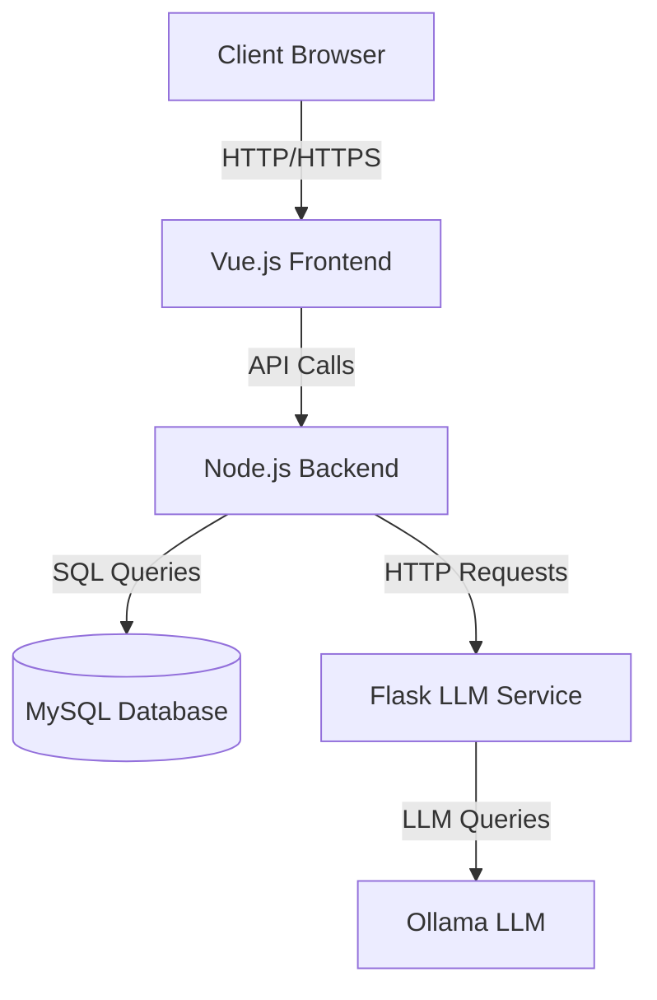
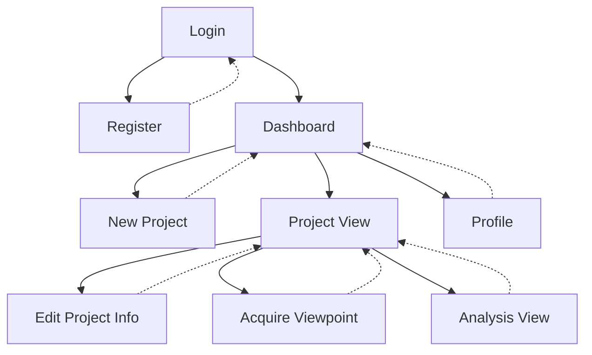

# CIcERonE

CIcERonE WebApp is an innovative tool designed to enhance the Contextual Inquiry process and requirements elicitation in software engineering. Based on mental space theory and cognitive linguistics, CIcERonE (Concatenate Interview with Early Requirement) offers a framework for organizing and analyzing qualitative data collected during stakeholder interviews.

## Overview
CIcERonE WebApp facilitates the transition from the informality of the real world to the semi-formality of requirements models, preserving the richness of original data. It utilizes natural language processing techniques to identify ambiguities, inconsistencies, and missing points in collected information.

Key features:
- Data structuring in a mental space lattice
- Effective management of multiple viewpoints
- LLM-assisted linguistic and semantic analysis
- Support for tacit knowledge identification

This tool is particularly useful for socio-technical system projects, where integrating social and technical components is crucial. CIcERonE WebApp helps analysts capture and interpret the nuances of human interactions and user needs, providing a solid foundation for subsequent conceptual modeling and requirements development.

## 1. System Architecture
CIcERonE WebApp is a Single Page Application (SPA) designed for Contextual Inquiry management. The architecture comprises:

1. **Frontend**: Implemented with Vue.js, managing the user interface and interactions.
2. **Backend**: A Node.js server with Express handling APIs, authentication, and database communication.
3. **Database**: MySQL for user and project data persistence.
4. **LLM Service**: A separate Flask server managing natural language processing using the Ollama LLM model.

This structure allows for a clear separation of responsibilities, with the frontend handling presentation, the backend managing business logic and data access, and the LLM service handling advanced natural language processing.




## 2. Project Structure

```
cicerone-webapp/
├── frontend/
│   ├── src/
│   │   ├── components/
│   │   │   ├── Login.vue
│   │   │   ├── Register.vue
│   │   │   ├── Dashboard.vue
│   │   │   ├── NewProject.vue
│   │   │   ├── EditProjectInfo.vue
│   │   │   ├── ProjectView.vue
│   │   │   ├── AcquireViewpoint.vue
│   │   │   ├── AnalysisView.vue
│   │   │   └── Profile.vue
│   │   ├── router/
│   │   │   └── index.js
│   │   ├── App.vue
│   │   └── main.js
│   ├── public/
│   └── package.json
├── backend/
│   ├── routes/
│   │   ├── auth.js
│   │   ├── projects.js
│   │   └── users.js
│   ├── middleware/
│   │   └── authenticateToken.js
│   ├── db.js
│   ├── dbInit.js
│   └── server.js
├── flaskRAG/
│   ├── app.py
│   ├── database.py
│   └── llm_functions.py
├── docs/
└── .env
```

## 3. Database Schema

```sql
CREATE TABLE users (
  id INT AUTO_INCREMENT PRIMARY KEY,
  username VARCHAR(255) NOT NULL UNIQUE,
  password VARCHAR(255) NOT NULL,
  email VARCHAR(255) NOT NULL UNIQUE,
  created_at TIMESTAMP DEFAULT CURRENT_TIMESTAMP
);

CREATE TABLE projects (
  id INT AUTO_INCREMENT PRIMARY KEY,
  user_id INT NOT NULL,
  title VARCHAR(255) NOT NULL,
  description TEXT,
  mental_space_lattice MEDIUMTEXT,
  analysis MEDIUMTEXT,
  generate_analysis BOOLEAN DEFAULT FALSE,
  created_at TIMESTAMP DEFAULT CURRENT_TIMESTAMP,
  FOREIGN KEY (user_id) REFERENCES users(id) ON DELETE CASCADE
);
```

## 4. Navigation Map




### Navigation Map Explanation:
- Solid arrows indicate forward navigation.
- Dashed arrows indicate return to the previous page.
- All pages (except Login and Register) require authentication.
- From the Dashboard, users can access new projects, view existing projects, or edit their profile.
- From Project View, users can edit project information, acquire new viewpoints, or view/generate analysis.


## 5. System Startup

To correctly start the CIcERonE WebApp system, follow this specific order:

1. Start the Flask service (LLM Service)
2. Start the Node.js backend
3. Start the Vue.js frontend

### Windows

1. Start the Flask service:
   ```
   cd path\to\flaskRAG
   .\venv\Scripts\activate
   python app.py
   ```

2. Start the Node.js backend (in a new terminal window):
   ```
   cd path\to\backend
   npm install
   npm start
   ```

3. Start the Vue.js frontend (in a new terminal window):
   ```
   cd path\to\frontend
   npm install
   npm run serve
   ```

### macOS e Linux

1. Start the Flask service:
   ```
   cd /path/to/flaskRAG
   source venv/bin/activate
   python app.py
   ```

2. Start the Node.js backend (in a new terminal):
   ```
   cd /path/to/backend
   npm install
   npm start
   ```

3. Start the Vue.js frontend (in a new terminal):
   ```
   cd /path/to/frontend
   npm install
   npm run serve
   ```

### Important Notes:
- Ensure all dependencies are installed before starting each service.
- The Flask service must be up and running before starting the Node.js backend.
- Verify that the environment variables in the .env file are correctly configured for your environment.
- If using a Python virtual environment for Flask, make sure to activate it before starting the service.


### Startup Verification

1. The Flask service should be available at http://localhost:5000 (or the specified port).
2. The Node.js backend should be running on port 3000 (or the specified port).
3. The Vue.js frontend will be accessible at http://localhost:8080 (or the address provided by the npm run serve command).

Once all services are running, you can access the CIcERonE WebApp application via the browser at the Vue.js frontend address.


### Contributing
We welcome contributions to CIcERonE WebApp! Please read our CONTRIBUTING.md for details on our code of conduct and the process for submitting pull requests.


### Acknowledgments

Thanks to all contributors who will help shape CIcERonE WebApp.
Special thanks to the research team behind the mental space theory and cognitive linguistics that inspired this project.
